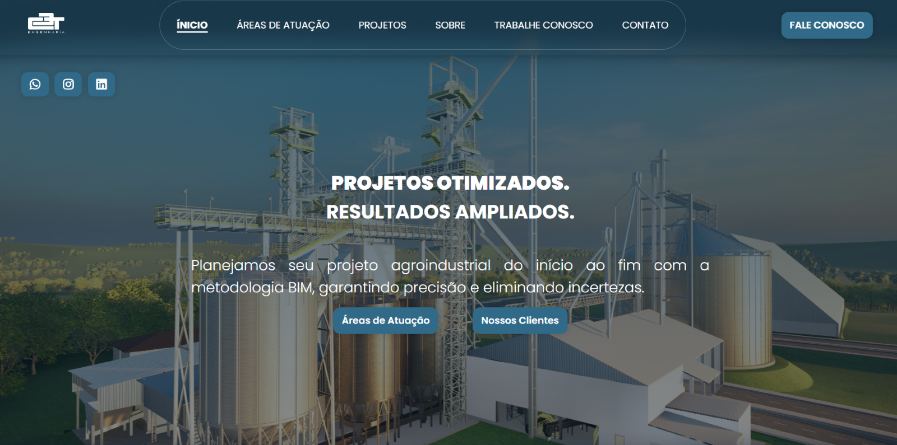
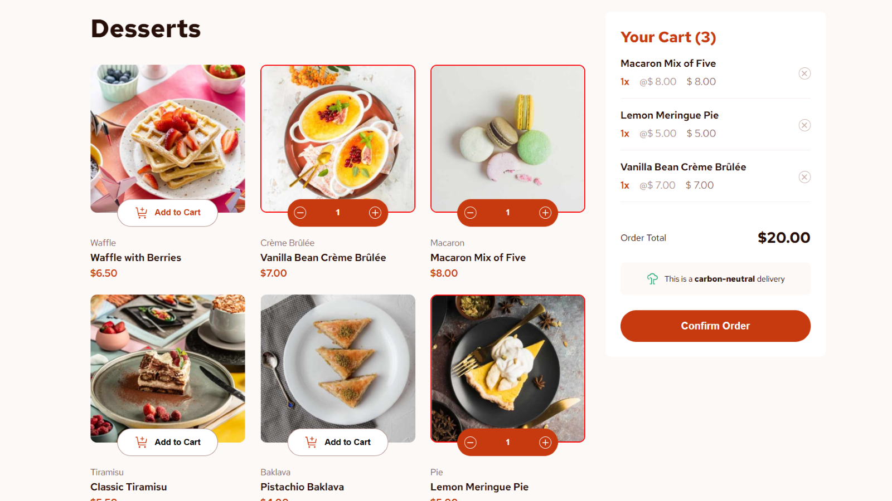
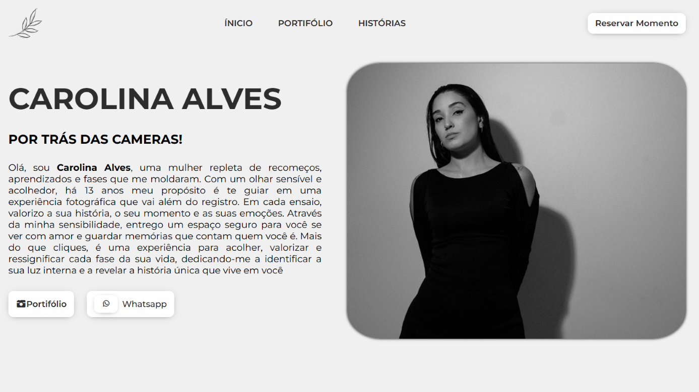

  <h1>José William</h1>
  <h3>Front-End Developer | JavaScript Ecosystem & UI Architecture</h3>
  
  

    Construindo interfaces performáticas com foco em <strong>Core Web Technologies</strong> (Vanilla JS, CSS3, HTML5).
     Especialista em manipulação de DOM, arquitetura modular e design responsivo.
  

 

<h2 align="center">Selected Work</h2>

<table border="0" width="100%">
  <tr>
    <td width="50%" valign="top">
      <h3 align="center">C3T Engenharia</h3>
      

         
      

      

        Plataforma corporativa com navegação complexa. 
        <strong>Stack:</strong> <code>IntersectionObserver</code>, <code>Mobile-First</code>.
      

    </td>
    <td width="50%" valign="top">
      <h3 align="center">Smart Cart Logic</h3>
      

        
      

      

        Gerenciamento de estado de carrinho e DOM reativo. 
        <strong>Stack:</strong> <code>Event Delegation</code>, <code>ES6 Arrays</code>.
      

    </td>
  </tr>
  
  <tr>
    <td colspan="2" valign="top">
      <h3 align="center">Carolina Alves Portfolio</h3>
      

        
      

      

        Foco em estética visual, grids e transições. 
        <strong>Stack:</strong> <code>CSS Grid</code>, <code>Custom Carousels</code>.
      

    </td>
  </tr>
</table>

 
<h2 align="center">Core Stack & Tools</h2>

  
  
  
  
  

  

<h3 align="center">Performance Metrics</h3>

  <table border="0" width="80%">
    <tr>
      <td align="center" width="33%">
        5+ 
        Projects Delivered
      </td>
      <td align="center" width="33%" style="border-left: 1px solid #ddd; border-right: 1px solid #ddd;">
        100% 
        Vanilla JS Focus
      </td>
      <td align="center" width="33%">
        2026 
        Ready for Hire
      </td>
    </tr>
  </table>

