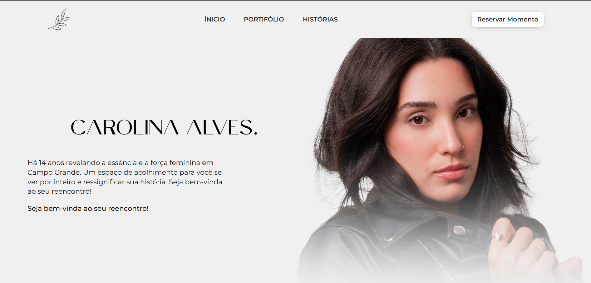
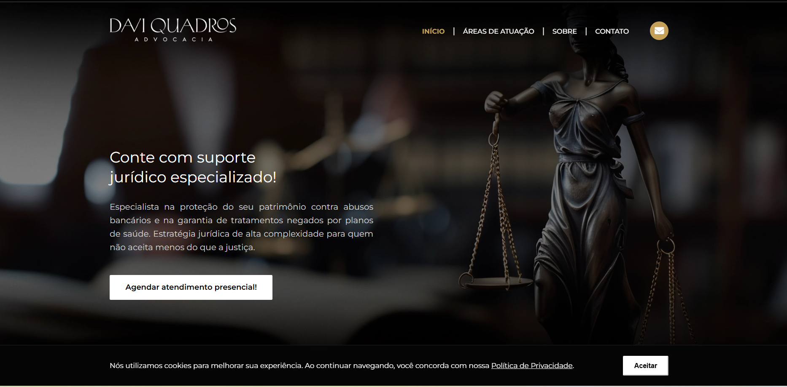
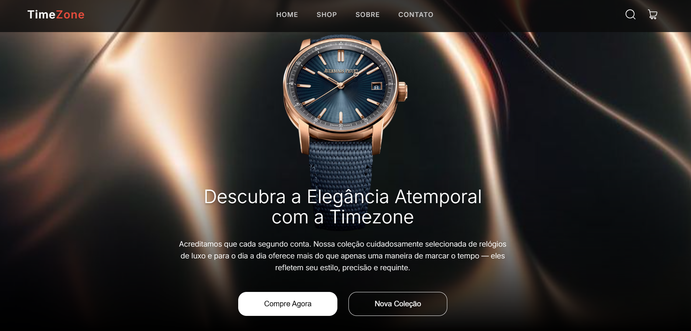

  <h1>José William</h1>
  <h3>Front-End Developer | UI Architecture & Technical SEO</h3>
  
  

    Construindo interfaces performáticas com foco em <strong>Ecossistema JavaScript</strong> (React & Vanilla JS). 
    Especialista em unir design responsivo e arquitetura modular com estratégias de <strong>Indexação Orgânica (SEO)</strong> e conversão.
  

 

<h2 align="center">🏆 Certifications & Expertise</h2>

  
  
  

 

<h2 align="center">💻 Selected Work</h2>

<table border="0" width="100%">
  <tr>
    <td width="50%" valign="top">
      <h3 align="center">Carolina Alves Portfolio</h3>
      

        
      

      

        Landing Page profissional focada em performance e UX. 
        <strong>Stack:</strong> <code>Vanilla JS</code>, <code>Scroll Reveal</code>, <code>JSON-LD SEO</code>.
      

    </td>
    <td width="50%" valign="top">
      <h3 align="center">Davi Quadros Advocacia</h3>
      

        
      

      

        Site institucional corporativo para escritório jurídico. 
        <strong>Stack:</strong> <code>Web Design</code>, <code>UI Architecture</code>, <code>Technical SEO</code>.
      

    </td>
  </tr>
  
  <tr>
    <td colspan="2" valign="top">
       
      <h3 align="center">E-Commerce Relógios</h3>
      

        
      

      

        Interface de loja virtual e apresentação de produtos. 
        <strong>Stack:</strong> <code>React</code>, <code>DOM Manipulation</code>, <code>CSS Grid</code>.
      

    </td>
  </tr>
</table>

 

<h2 align="center">🛠 Core Stack & Tools</h2>

  
  
  
  
  
  
  

  

<h3 align="center">📊 Performance Metrics</h3>

  <table border="0" width="80%">
    <tr>
      <td align="center" width="33%">
        SEO 
        Data-Driven Focus
      </td>
      <td align="center" width="33%" style="border-left: 1px solid #ddd; border-right: 1px solid #ddd;">
        100% 
        Responsive UI
      </td>
      <td align="center" width="33%">
        2026 
        Ready for Hire
      </td>
    </tr>
  </table>

